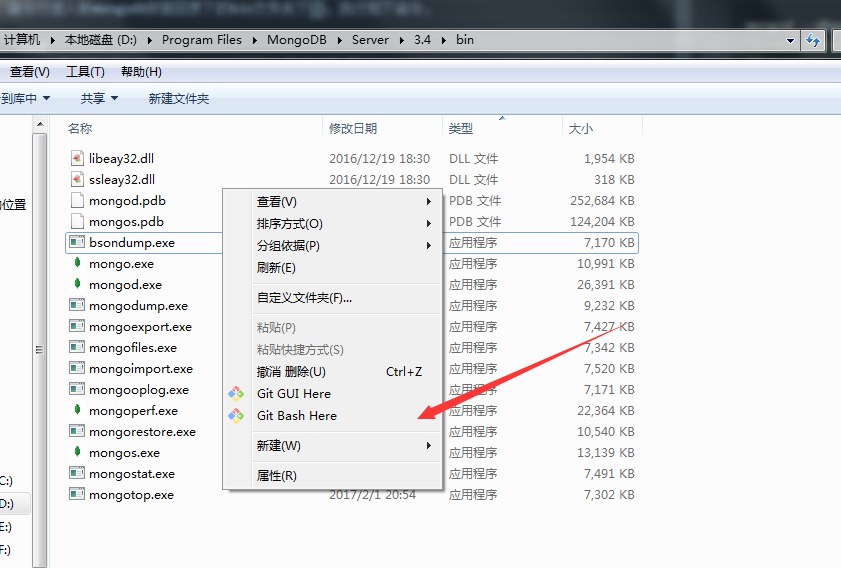

## 下载安装
首先，下载安装[MongoDB](https://www.mongodb.com/)，根据自己的电脑配置下载合适的版本（以下以win7为例），ok，下载之后我就安装到"D盘"，可以根据需要安装在其他位置。

## 启动
启动之前，我们要给mongodb指定一个文件夹，这里取名为"mongodb"，用来存放mongodb的数据。文件目录格式参考如下图，data下的db专门存放数据，log下的MongoDB.log为日志存放文件。


1. 启动数据库只需要两个命令mongod和mongo
- mongod：是mongoDB数据库进程本身
- mongo：是命令行shell客户端

2. 命令行进入到mongodb安装目录下的bin文件夹下(以下简称bin目录)。



3. 执行如下命令:，这里的意思是：dbpath指数据存放位置，logpath指日志存放文件，并且安装windows服务(运行成功后，win7下直接开始菜单搜索服务，便可以查看“MongoDB”服务，最好改为自动启动或延迟启动)，这样可以避免每次敲很长的启动代码。
``` bash
mongod --dbpath "E:\mongodb\data\db" --logpath "E:\mongodb\data\log\MongoDB.log" --install --serviceName "MongoDB"
```

4. 执行到这里，mongoDB服务器已经启动了。重新在bin目录下打开命令行，输入mongo（或者直接点击mongo.exe，看到connecting to: mongodb://127.0.0.1:27017）,至此就可以进行mongo的shell客户端操作了。

5. 如果你有单独的项目，想把数据库放在本地APP项目下。
- 可直接在项目顶层目录新建文件夹data，然后进入bin目录

``` bash
mongod  --dbpath 本地APP目录\data\
```
- 再次进入bin目录，打开第二个命令行，此窗口进行mongo数据操作
``` bash
mongo
```